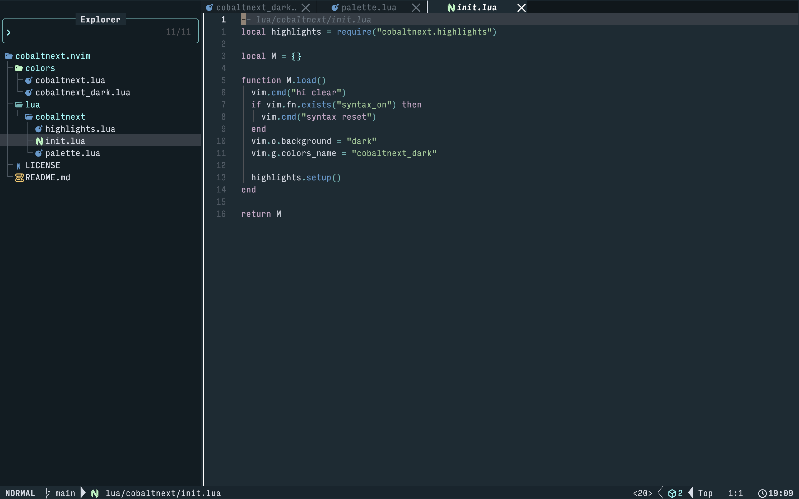
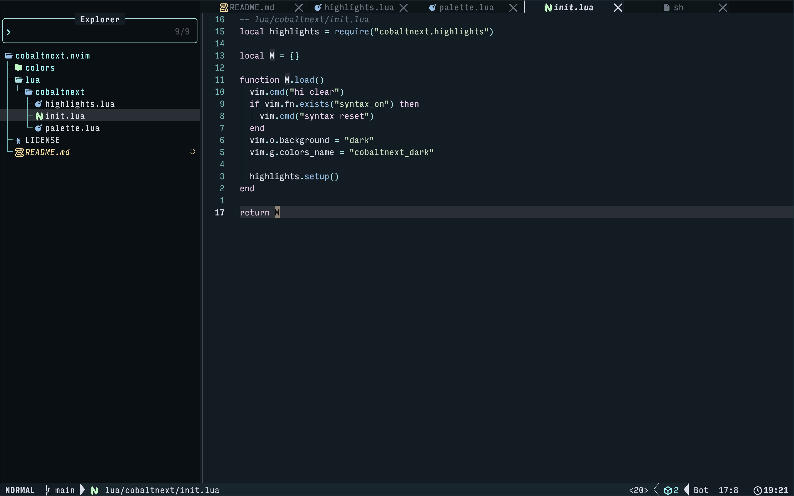

# 🌌 cobaltnext.nvim

A Neovim colorscheme based on the [CobaltNext VSCode](https://github.com/davidleininger/cobaltnext-vscode/) Themes.

In this fork, we restructured the plugin to support both the original **Dark** variant as well as the **Default** Cobalt Next palette.

## Previews

### Default (Cobalt Next)


### Dark (Cobalt Next Dark)


## Installation (lazy.nvim)

```lua
{
  "DanVicenteIhanus/cobaltnext.nvim",
  name = "cobaltnext",
  lazy = false,
  priority = 1000,
  config = function()
    -- Load your preferred variant here
    vim.cmd.colorscheme("cobaltnext") 
  end,
}
```

## Usage

Because this fork supports multiple palettes, you can hot-swap between them on the fly without restarting Neovim:

```vim
" Load the Default Cobalt Next palette
:colorscheme cobaltnext

" Load the Cobalt Next Dark palette
:colorscheme cobaltnext_dark
```
